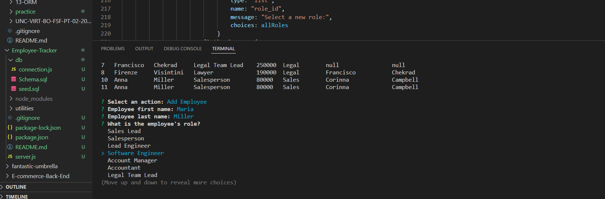

# Employee-Tracker

## Description
This application is meant to be used to keep track of the employees working at a company. The user can view department, roles, or employees, add a department role or employee, salary or update an employee's role in the company. 

## Screenshot

## License
- (https://opensource.org/licenses/MIT)
Refer to [https://choosealicense.com](https://choosealicense.com/),

## Installation
To install necessary dependencies, type the following command into the terminal:

npm init -y

npm i

## Usage
After installing necessary dependencies, type node index.js into the terminal and hit the Enter key to pull up the user inqueries. You will be promted to choose whether you would like to view or add an employee, role or department, or to update an employee's role in the company. 

Video walkthrough at: https://youtu.be/sAJXVZKkJI8

## Contribution
Pull requests are welcome. For any major changes, please open an issue first to discuss what you’d like to change. 

## Test
To source sql, type in terminal:

mysql -u root -p

SOURCE db/schema.sql;

SOURCE db/seeds.sql;

To exit: 

quit

To run, type into bash terminal:

node server.js

## Additional Questions
If you have any question about the application contact me directly at: [gisewaltzer@gmail.com]
You can find more of my work at: [gisewaltzer](https://github.com/gisewaltzer/),